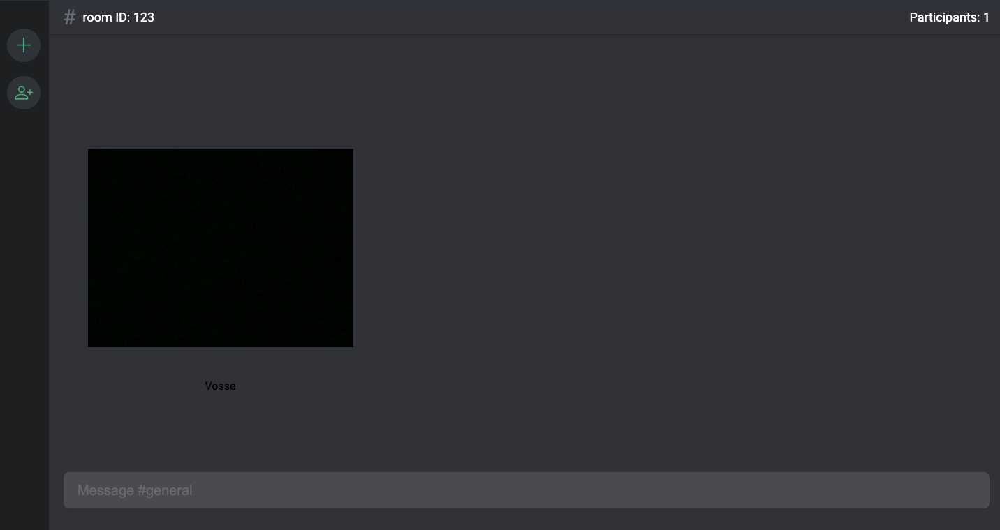

# Nodejs Discord Clone

This project is a discord clone made with Nodejs and Javascript. It utilizes WebRTC and Sockets to manage audio and video, user sessions and server driven events.


## Tech Stack

**Client:** Vite, Preact



**Server:** Node, Socket.IO, Peerjs


## Installation

Install and run nodejs-discord-clone with yarn in your computer

```bash
  cd client
  yarn
  yarn dev
```